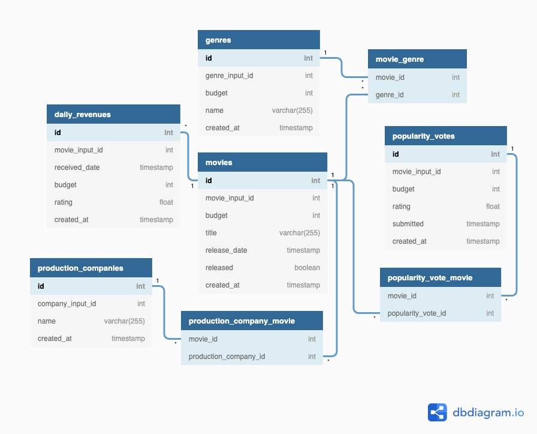

# Deliverables - Data Model
The purpose of this page is to capture key details regarding the Data Model.

## Visual Diagram of the Data Model
Please click [here](https://dbdiagram.io/d/5f8269b83a78976d7b77246d) to open interactive version of the visual diagram.

## DBML
See `dbdiagram.dbml` for the DBML (database markup language) of the Data Model.