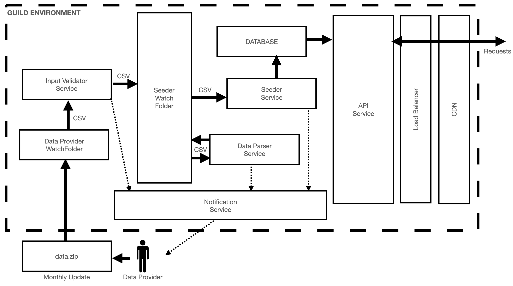

# Deliverables - Design
The purpose of this page is to capture key details regarding the Design.

## Block Diagram

## Details
In general the following components to be deployed to AWS.  

### Input - data.zip
`data.zip` is representing an agreed on input zip file name that the data provider to upload to the `Data Provider Watchfolder`. The ZIP file to have at least the following content with these specific file names:
- `movies_metadata.csv` => based on the CSV provided as example for this exercise
- `ratings.csv` => same information as based on the CSV provided as example for this exercise  

__pros:__
- minimize upload time
- widely accessible compression format
- provides additional checksum of the input data  

__cons:__
- creating the zip file is an additional input data preparation step on the Data Provider side

### Data Provider Watchfolder
An S3 bucket to which access is governed by a role that users of the Data Provider can assume. Role to provide read/write access to the bucket.  

__pros:__
- no need for us to manage user account access => controlled by the Data Provider
- still give us full control to revoke access to the bucket in case there is any concern
- programmable and UI access to upload content  
- scalable => each Data Provider could have their own S3 bucket => no collision of provider specific data, buckets could be availble in different reagons
- monitoring is readily available through AWS or through easy integration through specific third-party services, such as [DataDog](https://www.datadoghq.com/)

__cons:__
- must have AWS account to assume role

### Input Validator Service
Simple Lambda function that triggers on the new upload (PUT/POST request) to the `Data Provider Watchfolder`.  
Once triggered, it would pick up the uploaded `data.zip` after a pre-defined number of minutes later. Suggesting 15 minutes, but at least 5 minutes, so the Data Provider can still make corrections if necessary, without triggering the rest of the workflow.  
This service would send information to the `Notification Service` at least whenever an any errors were found, which would distribute notifications to the Data Provider and other parties as necessary.  
Once all CSVs in the `data.zip` successfully passed validation, they would be moved to `Seeder Watchfolder`.
Any `data.zip` pulled for input validation will be removed from the `Data Provider Watchfolder`. A backup copy will be saved ub the `Seeder Watchfolder` for troubleshooting, data history purpose. => see more under `Seeder Watchfolder`.

__pros:__
- scalable through AWS Lambda to match change in the amount of data received at each upload by the Data Provider
- when `data.zip` is only expected monthly, we would only have to pay for computing power during those specific times, whenever an update is received
- monitoring is readily available through AWS or through easy integration through specific third-party services, such as [DataDog](https://www.datadoghq.com/)

__cons:__
- none

### Seeder Watchfolder
An INTERNAL S3 bucket to which access is governed by a role that connected INTERNAL services can use to access it.  
Since our implementation is expecting the specific CSV files with specific file names and content structure, if a previous copy was already in place, it would be overwritten.  
S3 bucket to have versioning enabled, so have clear history of the updates we have received to support troubleshooting effort and maintain data history.  

__pros:__
- no need for us to manage user account access => controlled by the Data Provider
- still give us full control to revoke access to the bucket in case there is any concern
- accessibble through programmable AWS SDK and UI  
- scalable => each Data Provider could have their own S3 bucket => no collision of provider specific data
- bucket content could be easily cloned to various regions
- monitoring is readily available through AWS or through easy integration through specific third-party services, such as [DataDog](https://www.datadoghq.com/)

__cons:__
- must define revision history retention policy to meet our SLA requirements and internal evaluation efforts and also avoid bloated S3 bucket size
- if not set up properly, over time could lead to bloated S3 bucket size

### Data Parser Service
Lambda function that triggers on the new upload (PUT/POST request) to the `Seeder Watchfolder`.  
Once triggered, it would pick up the uploaded CSVs necessary to build the CSV formatted collections of files necessary to properly seed the `Database`. These CSVs would be saved to the `Seeder Watchfolder`.  
Once parsing all the input CSVs, it would trigger the `Seeder Service` to seed the database based on the newly generated DB model specific CSV files.  
This service would send information to the `Notification Service` at least whenever an any errors were found, which would distribute notifications to the Data Provider and other parties as necessary.  

__pros:__
- scalable through AWS Lambda to match
- when `data.zip` is only expected monthly, we would only have to pay for computing power during those specific times, whenever an update is received
- monitoring is readily available through AWS or through easy integration through specific third-party services, such as [DataDog](https://www.datadoghq.com/)

__cons:__
- none

### Seeder Service
Lambda function that is triggered by the `Data Parser Service`.  
Once triggered, it would pick up CSV formatted collections of files necessary to properly seed the `Database`. These CSVs would be saved to the `Seeder Watchfolder`.  
Once parsing all the input CSVs, it would trigger the `Seeder Service` to seed the database based on the newly generated DB model specific CSV files.  
This service would send information to the `Notification Service` at least whenever an any errors were found, which would distribute notifications to the Data Provider and other parties as necessary.  

__pros:__
- scalable through AWS Lambda to match  
- when `data.zip` is only expected monthly, we would only have to pay for computing power during those specific times, whenever an update is received  
- monitoring is readily available through AWS or through easy integration through specific third-party services, such as [DataDog](https://www.datadoghq.com/)  

__cons:__
- none  

### Database
AWS RDS instance of SQL or Postgres.  
See the Database Model details in the `deliverables/data_model` README of this repo.  

__pros:__
- scalable through AWS Lambda to match demand  
- monitoring is readily available through AWS or through easy integration through specific third-party services, such as [DataDog](https://www.datadoghq.com/)  

__cons:__
- need to be proactive understanding the amount of data expected to be stored here => might have to switch to other database solution  

### API Service
API service running on an AWS EC2 instance or AWS EKS cluster.  
Interface to the outside world to access the information the data models are required to support. See list of those details under the `Requirements` section of the main level `README` of this repo.  
Based on the requirements, only GET requests are supported without any payload in the requests.  
Access to this service could be anonymus, but strongly recommending user authentication at least through utilizing Basic Auth header.  
User access could be managed by us or through Oauth/Okta.  

__pros:__
- scalable through AWS EC2 to match demand
- could be accessed by other external services living in the AWS ecosystem => access to be controller through roles/policies  
- monitoring is readily available through AWS or through easy integration through specific third-party services, such as [DataDog](https://www.datadoghq.com/)  

__cons:__
- must set up user management workflow if opting to manage users ourselves  

### Load Balancer and CDN
AWS Elastic Load Balancing and CloudFront as CDN.  
Based on the fact that the database would only receive updates once a month, most of the time the responses would be static, therefore caching requests through either CDN with long TTL would be very helpful. Especially if future functionality expansion would have to support requests which would require time consuming computing.  

__pros:__
- scalable through AWS ELB/CloudFront to match demand
- monitoring is readily available through AWS or through easy integration through specific third-party services, such as [DataDog](https://www.datadoghq.com/)  

__cons:__
- must pay close attention to CDN TTL configuration and ensure cahced responses are refreshed whenever new data was available in the database